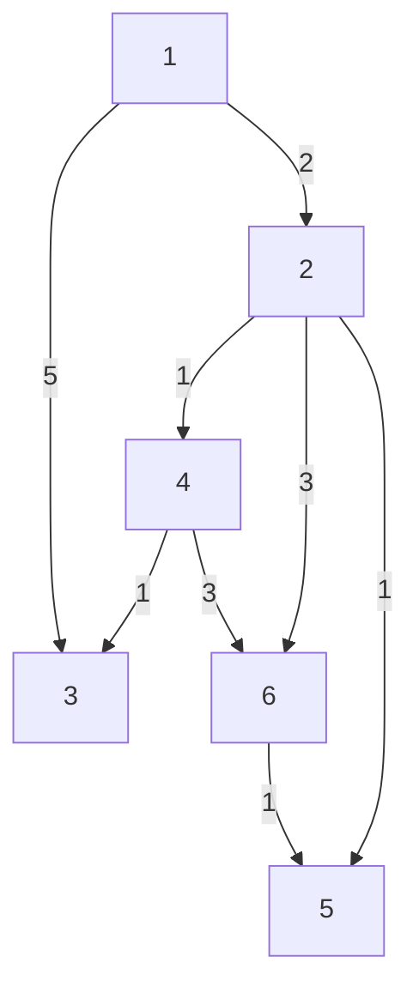
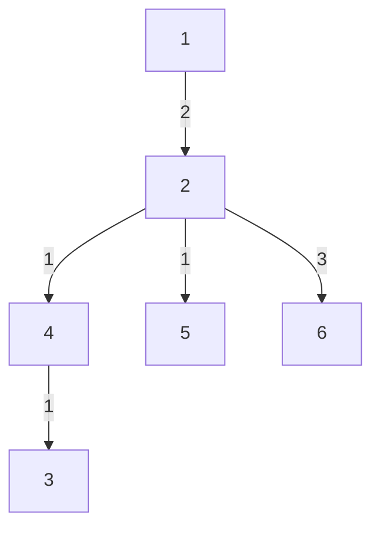

# Dijstrka's Algorithm
## Algorithm Info
- History (in a line):- Dijkstra thought about the shortest path problem when working at the Mathematical Center in Amsterdam in 1956 as a programmer to demonstrate the capabilities of a new computer called ARMAC.Dijstrka's Algorithm
- Date implemented (by me):- 25 July 2023
- Type of problem it solves:- Shortest distance from source vertex to all other vertices in a graph
- Alternatives:- [Floyd-Warshall](https://github.com/DarkMenacer/Legacy/tree/main/Programming/Classic%20Algorithms/Floyd%20Warshall/Floyd_Warshall.md), [Bellman Ford](https://github.com/DarkMenacer/Legacy/tree/main/Programming/Classic%20Algorithms/Bellman%20Ford/Bellman_Ford.md)
- Complexity:- $\displaystyle \Theta (|E|+|V|\log |V|)$

---
## Explanation of algorithm

Dijstrka's algorithm is a greedy algorithm working on the principle of choosing the unvisited vertex which is nearest to source and reducing distance of all other vertices based on this chosen vertex and repeating this until all vertices are visited.

The implementation of Dijstrka's algorithm is unintuitive at first sight due to it's use of priority queue data structure.\
Initially distance of all vertices is set to infinity. Then the distance of source vertex is set to zero and is enqueued in the priority queue. Then the algorithm starts its rounds.
On each round, the top element of priority queue is stored and then the priority queue is dequeued. If this element is the vertex that is unvisited, then all the edges of this vertex are checked and distances of all it's neighbours is reduced and the neighbours are enqueued onto the priority queue and moves to the next round.
If the vertex is visited however, then the algorithm directly moves to the next round without checking it's edges.\
Such rounds are repeated until the priority queue is empty, i.e. all vertices have been visited at least once if the graph is fully connected. At this point, the algorithm stops.

One of the main problems with Dijstrka's Algorithm is that it cannot handle edges with negative weights.

## Sample to understand the solution

### I/O Format

#### Input
n m\
$a_1$ $b_1$ $c_1$\
...\
$a_m$ $b_m$ $c_m$

n = no. of vertices\
m = no. of edges\
all subsequent lines are the directed edges {a, b, c} where a is source, b is destination and c is the weight

#### Output
0 $d_2$ $d_3$ ... $d_n$
where $d_i$ represents the weighted distance between vertex $1$ and vertex $i$

### Sample Case

#### Input
6 8\
1 2 2\
1 3 5\
2 4 1\
2 6 3\
2 5 1\
4 3 1\
4 6 3\
6 5 1

#### Output
0 2 4 3 3 5

#### Explanation
Initial graph

After shortest paths from vertex 1

---
