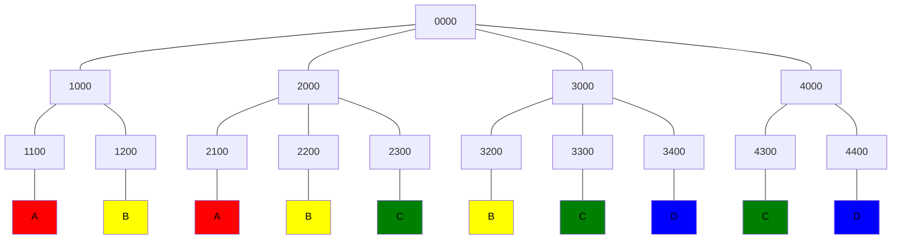

# Array Description
## Program Info
- Platform/Source:-     CSES Dynamic Programming 
- Date:-                24 August 2022
- Type of Problem:-     Identifying Parameters, 2D Dynamic Programming
- Status:-              Solved
#### Complexity:-       O(n²)
---
## Solution in brief

Starting with a string with all 0s, it is observed that the number of arrays for each place depend on
1. The position and
2. The number placed

i.e. for each ordered pair of (position,number), same number of arrays are possible.

Therefore a 2D memoization table is constructed with **position** as y axis and **numbers** as x axis.\
Each entry $a_{ij}$ represents the total possible arrays when number $j$ is placed at position $i$

The table is constructed from the bottom as if last value is unknown then for each number at the position, only 1 array is possible.
This acts like a base criteria of dynamic programming.\
The recursive formula is 

$\text{If } x[j] \text{ is unknown(i.e. 0) then }$ 
$$\text{memoize}[i][j] = \text{memoize}[i+1][j-1] + \text{memoize}[i+1][j] + \text{memoize}[i+1][j+1] $$

$\text{Else if } x[j] \text{ is known(i.e. not 0) then }$ 
$$\text{memoize}[j][x[j]] = \text{memoize}[j+1][x[j]-1] + \text{memoize}[j+1][x[j]] + \text{memoize}[j+1][x[j]+1] $$

## Sample to understand the solution

### Input
4 4\
0 0 0 0

### Output
68

### Explanation

As seen, both the strings '1100' and '2100' have equal number of arrays possible\
Hence we need to calculate them only once and stored in the memoize table

Below is the Memoize Table ( **position** as y axis and **numbers** as x axis) ($A = \text{Memoize}[2][1]$, $B = \text{Memoize}[2][2]$)

|     | 0   | 1   | 2   | 3   | 4   |
| --- | --- | --- | --- | --- | --- |
| 0   | 0   | 13  | 21  | 21  | 13  |
| 1   | 0   | 5   | 8   | 8   | 5   |
| 2   | 0   | 2   | 3   | 3   | 2   |
| 3   | 0   | 1   | 1   | 1   | 1   | 

---