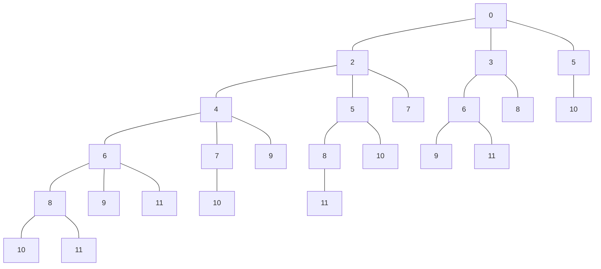

# Coin Combinations II
## Program Info
- Platform/Source:-     CSES Dynamic Programming
- Date:-                17 August 2022
- Type of Problem:-     Ordering Recursion, Dynamic Programming
- Status:-              Solved
#### Complexity:-       O(n²)
---
## Solution in brief

This problem is an extension of its predecessor in the list. Consider both as a pair.\
Pay close attention to the codes here and code in "Coin Combinations I".
They are almost identical apart from the order in which for loops are nested.

As the order matters in this case, the coins, taken one by one, and once used are never considered again, starting from the least.

To understand why this works, construst a tree, with 0 as its root. To ensure that the set isn't repeated, a restriction is put.
Once a higher value coin is added, a lower value coin can't be added (look at the sample explanation for clearer understanding).
The number of times, 'x'(desired sum of money) appears, is the solution to the problem.

## Sample to understand the solution

### Input
3 11\
2 3 5

### Output
4

### Explanation

On the left subtree, only 2s are added. Once a 3 is added, 2 can't be added further (as evident in the middle subtree)\
The right subtree contains increments by 5 hence neither 2 or 3 is added further.
MIND that the implement DIFFERS SIGNIFICANTLY because a bottom-up approach is used which is faster and cleaner.

For bottom-up approach, sort all coins and once start with an array (of size 12) with all elements initialised to 0 except first index i.e. memoise[0] = 1\
Now for each coin (from least to most valued),\
    Traverse all of memoise array and add the coin value to current index to get a new index and add older index's value to the new index.

---