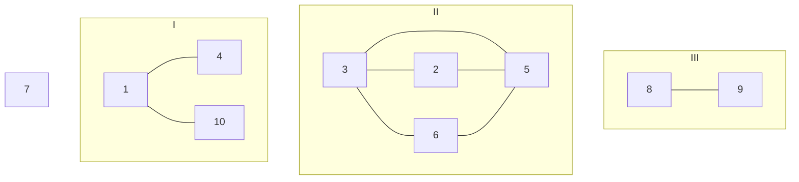
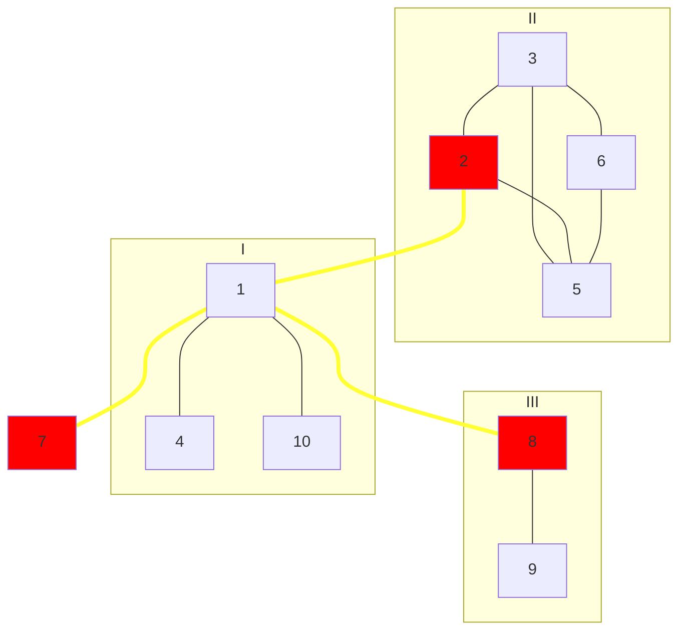

# Building Roads
## Program Info
- Platform/Source:- CSES Graphs
- Date:- 14 June 2023
- Type of Problem:- Disjoint Set Union (DSU)
- Status:- Solved
#### Complexity:- O(n) 
---
## Solution in brief

The basic idea behind solving this problem lies in observing that if all cities are connected, then no node will remain unvisited if a depth-first-search is conducted.

Therefore, a depth-first-search is conducted arbitrarily from city 1 and all cities that are visited are marked.\
Now there will be cities which will be unvisited as they are completely disconnected from all cities that can be reached by city 1.\
So one such city is chosen, it is marked as a city which needs to be connected to city 1, and yet another depth-first-search is conducted from it, marking all cities that can be visited from this city.\
This process is repeated till all cities are visited.\
Finally roads are built between all the cities which are marked to be connected with city 1 and city 1.

## Sample to understand the solution

### Input
10 8\
1 4\
1 10\
3 5\
3 6\
3 2\
2 5\
6 5\
8 9

### Output
3\
1 2\
1 7\
1 8

### Explanation

Initially: 

A depth-first-search from city 1 is conducted and cities 1, 4 and 10 are marked as visited.\
Now city 2 is still unvisited hence a depth-first-search from city 2 is conducted and cities 2, 3, 5, 6 are marked as visited and city 2 is marked as connector.\
Similarly city 7 is unvisited, hence it is marked as a connector and a depth-first-search is conducted from it.\
Still city 8 is unvisited, so the similar procedure is followed.\
Finally all connectors are connected to city 1 and the final graph looks something like this.

---
