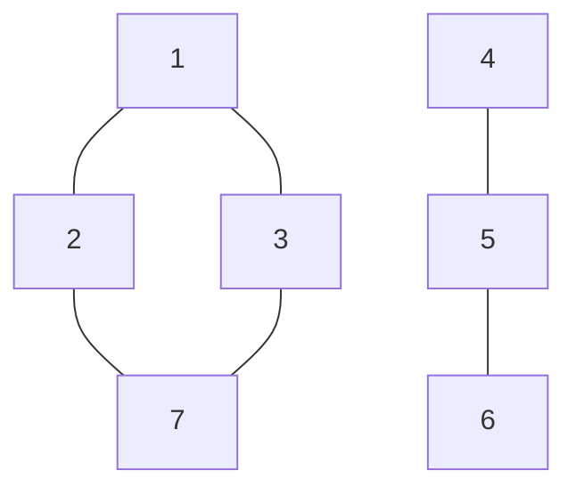
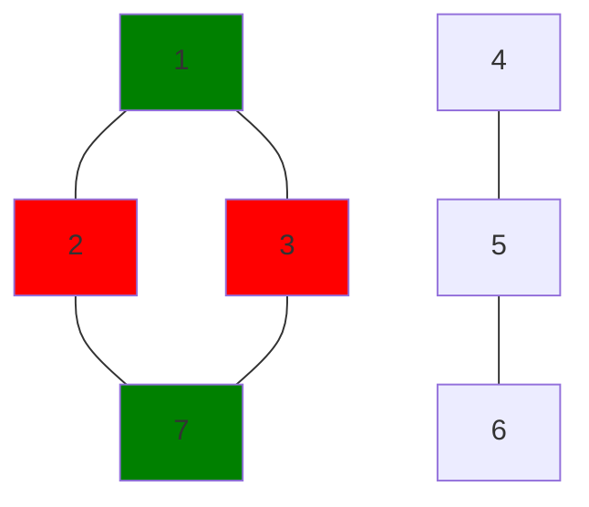
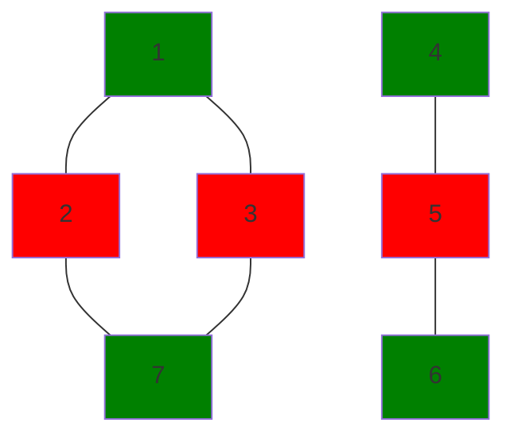

# Building Teams
## Program Info
- Platform/Source:- CSES Graphs 
- Date:- 18th June 2023
- Type of Problem:- Bipartite Graphs
- Status:- Solved
#### Complexity:- O(n)  
---
## Solution in brief

This problem can be solved by realising that each pupil should have a different team from his/her friend. Therefore this works as a criterion for assigning teams and checking possibility.

A depth-first-search is conducted arbitrarily from node 1, and each node is assigned team 1 if its parent is in team 2 and team 2, if its parent is in team 1.\
Then all the neighbors of this node are checked and if any of them are in the same team then search is exited and impossible is printed, else the the depth-first-search continues

## Sample to understand the solution

### Input
7 6\
1 2\
1 3\
2 7\
3 7\
4 5\
5 6

### Output
1 2 2 1 2 1 1

### Explanation

Visulising the network:

After dfs starting from node 1

As node 4 is still unvisted, another dfs starting from node 4 and final result

---

