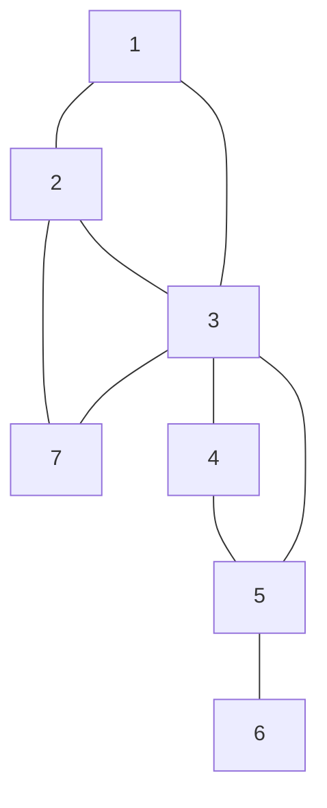
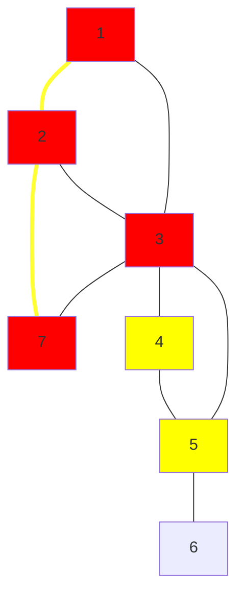

# Message Route
## Program Info
- Platform/Source:- CSES Graphs 
- Date:- 14 June 2023
- Type of Problem:- Find path by Breadth-First-Search 
- Status:- Solved
#### Complexity:- O(n) 
---
## Solution in brief

As shortest route needs to be found out, it makes sense to use a breadth-first-search starting from node 1.\
For node 1, it's immediate neighbors are enqueued and their parent is registered as node 1, given that they haven't been visited or enqueued before. Then the next element of queue is considered and node 1 is considered as visited.
This process continues until node n is encountered or the queue is found to be empty, in which case the breadth-first-search stops.

## Sample to understand the solution

### Input
7 9\
1 2\
1 3\
2 3\
2 7\
3 7\
3 4\
3 5\
4 5\
5 6

### Output
3\
1 2 7

### Explanation
Visualising the network:

Breadth-First-Search result, where highlighted edges represent the shortest path, nodes highlighted in red are visited and nodes highlighted in yellow were in queue when node 7 was found

---
