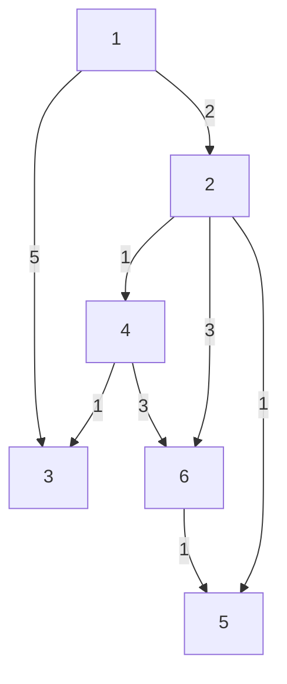
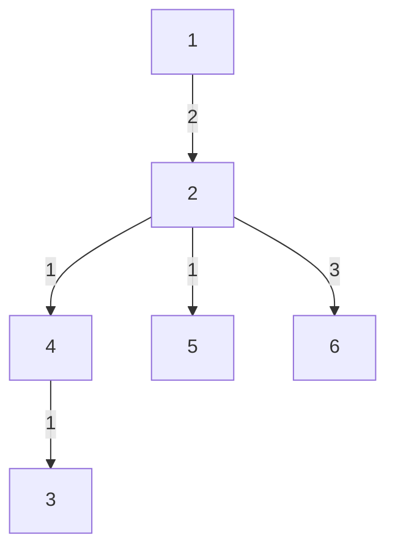

# Shortest Routes I
## Program Info
- Platform/Source:- CSES Graphs 
- Date:- 25 July 2023
- Type of Problem:- Shortest paths
- Status:- Solved
#### Complexity:- O(n + m\*log(m)) 
---
## Solution in brief

This is a classic graph problem. There are 3 approaches to solve this problem (all not as efficient).
1. [Bellman-Ford Algorithm](https://github.com/DarkMenacer/Legacy/tree/main/Programming/Classic%20Algorithms/Bellman%20Ford/Bellman_Ford.md)
2. [Floyd-Warshall Algorithm](https://github.com/DarkMenacer/Legacy/tree/main/Programming/Classic%20Algorithms/Floyd%20Warshall/Floyd_Warshall.md)
3. [Djikstra's Algorithm](https://github.com/DarkMenacer/Legacy/tree/main/Programming/Classic%20Algorithms/Dijstrka/Dijstrka.md)

Djikstra's Algorithm is the most efficient for large graphs hence this one is used for this particular problem.

## Sample to understand the solution

### Input
6 8\
1 2 2\
1 3 5\
2 4 1\
2 5 1\
2 6 3\
4 6 3\
4 3 1\
6 5 1

### Output
0 2 4 3 3 5

### Explanation

Initial graph

After shortest paths from vertex 1

---

