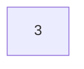
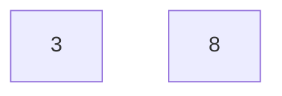
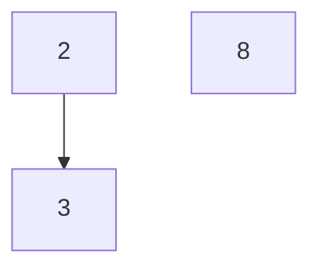
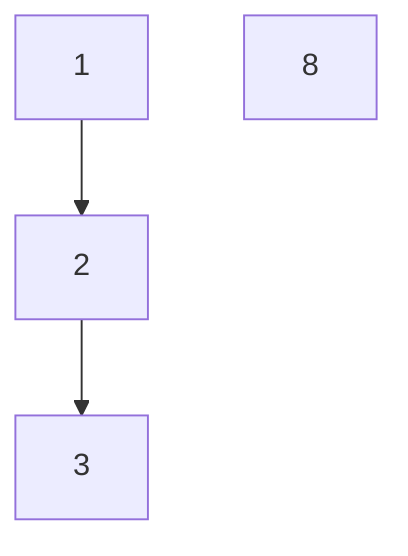
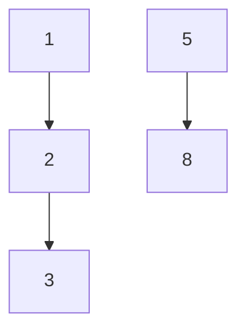

# Towers
## Program Info
- Platform/Source:-     CSES Sorting and Searching
- Date:-                24 January 2022
- Type of Problem:-     Greedy, Using Multiset
- Status:-              Solved
#### Complexity:-       O(n * logn)
---
## Solution in brief

The key realisation to solve this problem is that for any block, it is best to add it on top of the block which is as close to it as possible (in terms of number written on it), i.e. the difference should be as less as possible.

Therefore for each input, upper bound is found in the multiset.\
If it is end(), then a new tower is required, else the upper_bound is erased and new element is added.\
At the end, the size of the multiset is printed.

## Sample to understand the solution

### Input
5\
3 8 2 1 5
### Output
2

### Explanation

Initially multiset is empty.\

When 3 is read:

When 8 is read:

When 2 is read:

When 1 is read:

When 5 is read:

Therefore minimum 2 towers are needed

---