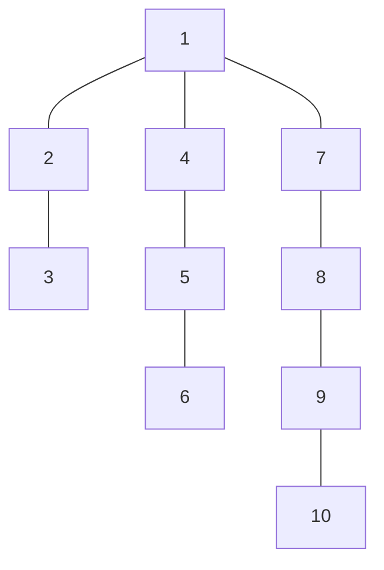

# Company Queries I
## Program Info
- Platform/Source:-     CSES Tree Algorithms 
- Date:-                21 February 2023
- Type of Problem:-     Time-Space Trade off, Sparse Table
- Status:-              Solved
#### Complexity:-       O(logn) * O(n) {n queries and O(logn for each queries)}
---
## Solution in brief

Naively, it can be realised that if the direct boss (parent vertex) of each exployee is stored, then based on the number of levels to traverse, the answer can easily be found out by jumping that many levels.\
[Here](https://cses.fi/paste/0b9a4087cdad4f8b545779/) is the implementation of it. Naturally this isn't the best way because it consumes too much time ($O(n^2)$). A faster solution can be adopted.

The next approach which comes to mind is to then store all the bosses (ancentry) of a particular employee ($O(n)$) so each query can be calculated in constant time.
[Here](https://cses.fi/paste/daccd539bbfabca654576e/) is the implementation of it. The issue with this implementation is the amount of memory being used. Consider the size of an array, dimensions $20000 \times 20000$ storing integers, (almost $800$ MB) which is incredibily high and unacceptable.

Only using time, gives Time Limit Error and only using memory, gives Memory Limit Error hence a middle ground needs to be adopted.\
So storing the ancestors which are **powers of 2s away** is a nice middle to adopt. That is, for any vertex, store the ancestors which are $1, 2, 4, 8...$ levels above it. By doing this, for larger levels, lot of the distance can be quickly covered by huge jumps and there are no memory issues for larger levels because there is an exponential decrease in the values being stored for a particular vertex.

This is a brilliant approach because this is leveraging $2^n$, which is usually dreaded but this time, $2^n$ is used as a tool by programmer and not imparted as a restriction.

## Sample to understand the solution

### Input
10 5\
1 2 1 4 5 1 7 8 9\
10 1\
10 2\
10 3\
10 4\
10 5

### Output
9\
8\
7\
1\
-1

### Explanation

| Vertex | Ancestors stored |
| ------ | ---------------- |
| 1      |                  |
| 2      | 1                |
| 3      | 2 1              |
| 4      | 1                |
| 5      | 4 1              |
| 6      | 5 4              |
| 7      | 1                |
| 8      | 7 1              |
| 9      | 8 7              |
| 10     | 9 8 1            |

For 10 3, firstly, 10 2 (i.e 8) is visited, then 8 1 is the answer.

---