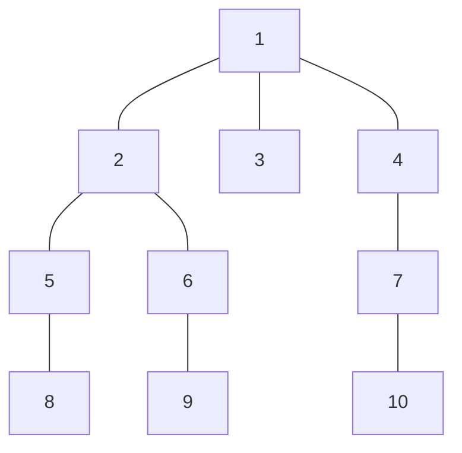

# Company Queries II
## Program Info
- Platform/Source:-     CSES Tree Algorithms
- Date:-                23 February 2023
- Type of Problem:-     Binary Lifting
- Status:-              Solved
#### Complexity:-       O(n*logn)
---
## Solution in brief

Just like in [Company Queries I](../Company%20Queries%20I/Company_Queries_I.md), it becomes apparent that not all ancestors of a vertex can be stored and linear traversing would be too slow hence power of 2 ancestors are stored $(1^{st}, 2^{nd}, 4^{th}, 8^{th}...)$

Now, it is observed that if the 2 vertices in contention are on the same level it is easier to find their common ancestor as it would be same distance higher, hence the one of the two which is placed deeper is adjusted so that it is now on the same level as the other (by finding out the $k^{th}$ ancestor of the deeper vertex just like in [Company Queries I](../Company%20Queries%20I/Company_Queries_I.md))

Finally when both vertices are on the same level, a binary-search kind-of approach is used to find the lowest common ancestor.

## Sample to understand the solution

### Input
10 5\
1 1 1 2 2 4 5 6 7\
6 8\
7 8\
2 3\
4 7\
8 10

### Output
2\
1\
1\
4\
1

### Explanation

For 1st and 2nd query, 8 is brought one level up (to 5) so that it matches the level of 6 (and 7).

---