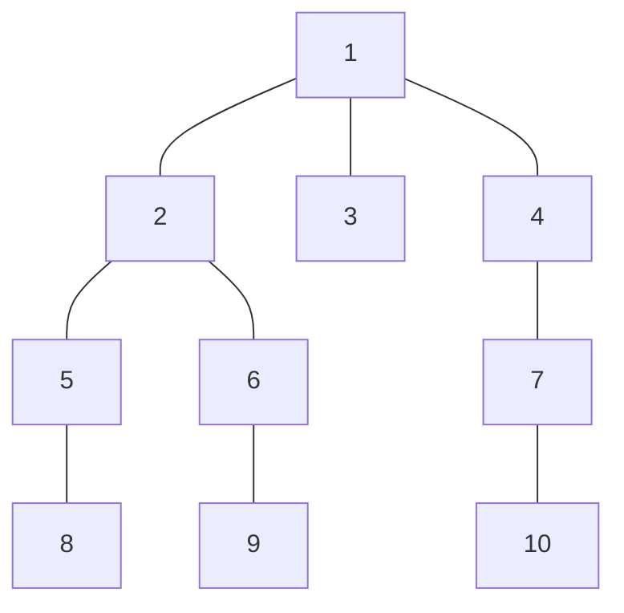

# Distance Queries
## Program Info
- Platform/Source:-     CSES Tree Algorithms
- Date:-                24 February 2023
- Type of Problem:-     Binary Lifting
- Status:-              Solved
#### Complexity:- O(n*logn)
---
## Solution in brief

The answer can be calculated in constant time if the lowest_common_ancestor of the 2 vertices in contention is known.

$$\text{distance}(A,B) = \text{level}(A) + \text{level}(B) - 2 * \text{level}(\text{LCA}(A, B))$$

where $\text{LCA}(A,B)$ represents lowest common ancestor of vertices $A$ and $B$.

Now LCA can be found out as seen in [CSES Company Queries II](../Company%20Queries%20II/Company_Queries_II.md)


One huge realisation was that having following 3 lines of code
```
ios_base::sync_with_stdio(0);
cin.tie(0); cout.tie(0);
```
helped pass all test cases which gave TLE if these were not included

## Sample to understand the solution

### Input
10 5\
1 2\
1 3\
1 4\
2 5\
2 6\
4 7\
5 8\
6 9\
7 10\
6 8\
7 8\
2 3\
4 7\
8 10

### Output
3\
5\
2\
1\
6


### Explanation



$\text{distance}(6,8) = \text{level}(6) + \text{level}(8) - 2 * \text{level}(2)) = 3$

---