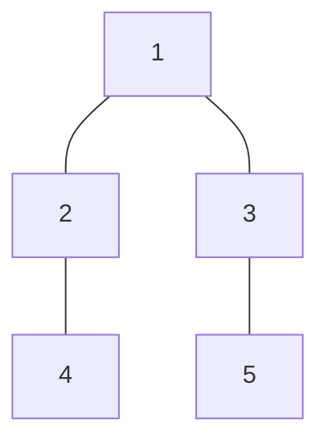

# Subordinates
## Program Info
- Platform/Source:- CSES Tree Algorithms 
- Date:-    25 Jan 2023
- Type of Problem:- Depth First Search, Dynamic Programming
- Status:- Solved
#### Complexity:-    O(n)
---
## Solution in brief
To calculate the subordinates under any person, first subordinates of the subordinates need to be calculated. This indicates that recursion needs to be used, more specifically, depth first search.\
A simple depth first search algorithm is used at the root node.\
If the node has no leafs, then the recursion bottoms out with the no. of subordinates (memoise array in case of the solution presented here) being set equal to 0.\

General formula

$\text{memoise}[x] = \begin{cases}
    0 & \text{x has no subordinate} \\
    \sum (\text{memoise}[\text{subordinate}] + 1) & \text{otherwise}
\end{cases}$

## Sample to understand the solution

### Input
5\
1 1 2 3

### Output
4 1 1 0 0

### Explanation

---