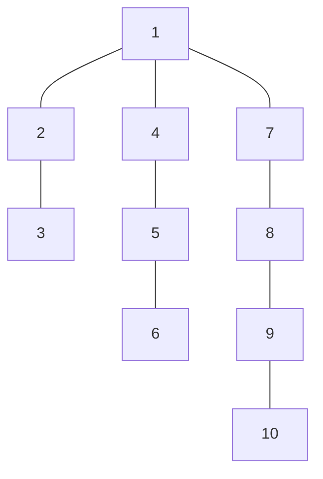
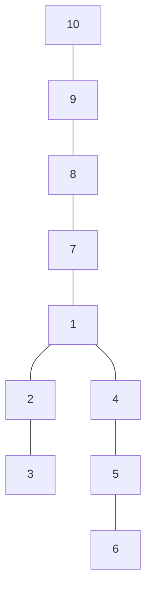

# Tree Diameter
## Program Info
- Platform/Source:-     CSES Tree Algorithms 
- Date:-                11 February 2023
- Type of Problem:-     Depth First Search
- Status:-              Solved
#### Complexity:-       O(n)
---
## Solution in brief

The problem can be easily solved by first applying depth-first-search on a arbitrarily rooted tree and finding the deepest node, then using this deepest node as a root and again finding the deepest node to this new root.

The distance between this new root and this new deepest node is the diameter of the tree.

## Sample to understand the solution

### Input
10\
1 2\
2 3\
1 4\
4 5\
5 6\
1 7\
7 8\
8 9\
9 10

### Output
7

### Explanation

The tree is arbitrarily rooted at 1

On the first depth first search, the deepest node is found out to be 10.
Now a tree constructed with 10 as the root

Now the deepest node is 6, and it is 7 nodes away.
This is the diameter of this tree.

---