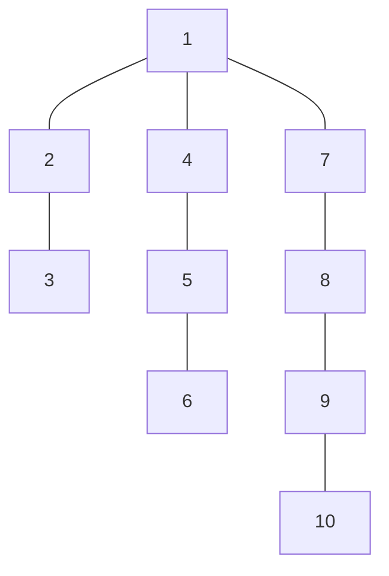

# Tree Distances I
## Program Info
- Platform/Source:-     CSES Tree Algorithms  
- Date:-                16 February 2023
- Type of Problem:-     Path between any 2 vertices
- Status:-              Solved
#### Complexity:-       O(N)
---
## Solution in brief

For the extremities of the diameter of the tree, say A and B, the max distance is the diameter of the tree.

Now for any node which lies in the path of travelling from one extreme to the other, i.e. A <-> B, the maximum distance of another node is either of the 2 extremes (the one that is the farthest).

For any other node (which is neither the extremity nor lies on the diameter), the max distance can be recursively calculated by adding 1 to the parent of it and there will be at least one of the ancestors of such a vertex lying on the diameter (path between A and B).

## Sample to understand the solution

### Input
10\
1 2\
2 3\
1 4\
4 5\
5 6\
1 7\
7 8\
8 9\
9 10

### Output
4 5 6 5 6 7 4 5 6 7

### Explanation

Here the extremities are 6 & 10, so max distance for them is the diameter, i.e. 7\
Now for the nodes lying in the path between 6 & 10, i.e. 5 4 1 7 8, the max distance is from either of 6 or 10, depending on which is farther.\
Lastly for nodes 2 & 3, which are neither extremities nor in the path, the max distance is just 1 more than their parents (1 & 2) respectively.

---