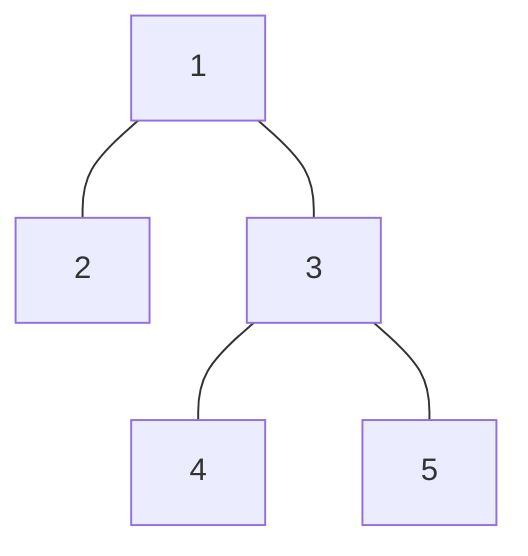

# Tree Distances II
## Program Info
- Platform/Source:-     CSES Tree Algorithms
- Date:-                16 February 2023
- Type of Problem:-     Math, Using Depth-First-Search as a Tool
- Status:-              Solved
#### Complexity:- O(n)
---
## Solution in brief

The first realisation is that for even leaf node, the sum of distances can be found out easily just looking at the parent using the formula 
$$\text{leaf} = (\text{parent} - 1) + (n - 2) + 1 $$

Explaining bracket-wise (of RHS)\
First, from the parent's answer, $1$ is contributed by the leaf itself which need not be included

Then all the other, i.e. $n-2$ nodes are just $1$ node farther from the leaf than the parent

Finally, $1$ is added because parent itself is $1$ far away from leaf

All of the above can be understood well, taking $2$ as leaf in the tree shown below

Now it is realised that, for every node, there will be some contribution from the parent and some from children (for leaf this is zero)\
Considering $3$ as an example of non-leaf node, and consider that answer of parent, $1$ is already known (calculated by depth-first-search).

The problem of using the same formula as above again is that, for the second bracket ($n-2$), the children of 3 are counted as 1 node farther than it's parent, whereas they being $3$'s children are in fact, 1 node closer. So generalising the formula by subtracting twice the no. of children (needs to be calculated beforehand)
$$\text{vertex} = \text{parent} - 2 + n - (2\times\text{children})$$

Arbitrarily rooting tree at 1, the answer can be found out for each node, in 2 depth-first-searches (one to calculate no. of children and answer for the root, other to use the above formula and calculate final answers).

## Sample to understand the solution

### Input
5\
1 2\
1 3\
3 4\
3 5

### Output
6 9 5 8 8

### Explanation

The tree is same as the one illustrated earlier.\
First, answer for $1$ is calculated, i.e. $6$.\
Then for every node the generalised formula is used to calculate final answers.

---