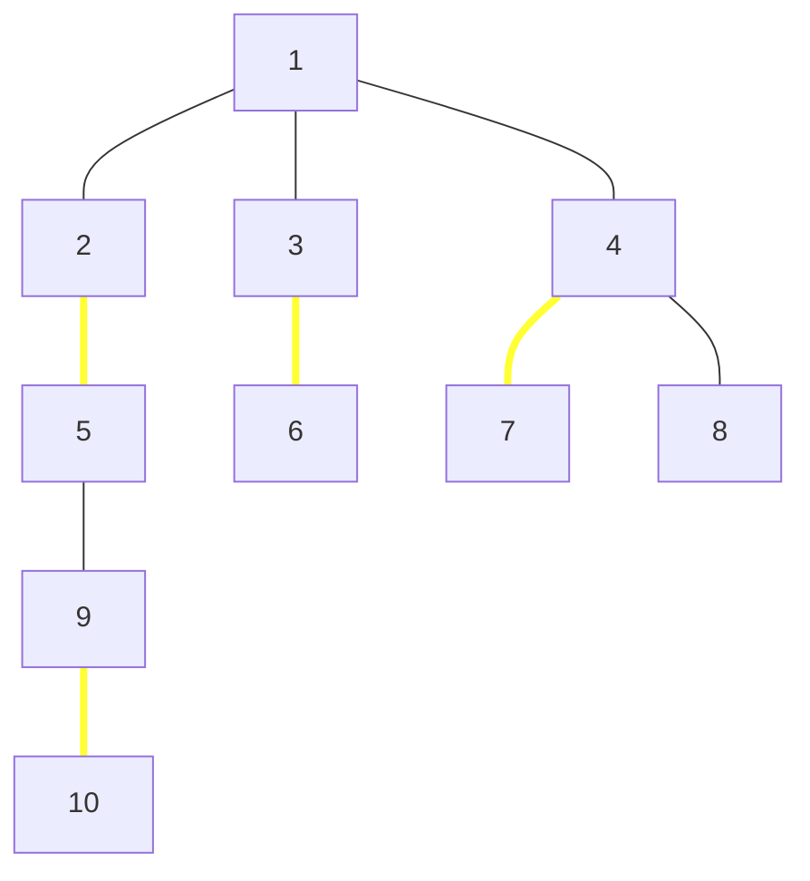

# Tree Matching
## Program Info
- Platform/Source:- CSES Tree Algorithms
- Date:-            10 February 2023
- Type of Problem:- Dynamic Programming
- Status:-          Solved
#### Complexity:-   O(n)
---
## Solution in brief

The key to solve this problem lies in identifying that for each vertex, there are 2 possibilities, either it will be included or it won't be.\
If it is not included, them the problem breaks down into $c$ sub-problems, where $c$ is the no. of children of vertex.

Eg:
If $1$ is not to be included in following tree, then the problem breaks down into 3 subproblems

Therefore 2 cases need to be considered, 
answer of the subtree rooted at any vertex $V$:
1. When $V$ is to be included
2. When $V$ is to be excluded

Let $\text{memoize}[v,0]$ represent that $V$ is to be excluded and $\text{memoize}[v,1]$ represent that the tree has to be included

Now, for leaf nodes, both $\text{memoize}[v,0] = 0 = \text{memoize}[v,1]$: **Base condition**

For each-non leaf node ($c$ represents it's child)
$$\text{memoize}[v,0] = \displaystyle\sum_{c} \text{max(memoize}[c,0]\text{, memoize}[c,1])$$

Calculating $\text{memoize}[v,1]$ is a bit tricky because it involves choosing the right child $s$ which has maximum value when it is **not** chosen. Therefore

$$\text{memoize}[v,0] = \text{max}(\displaystyle\sum_{c-s} [\text{max(memoize}[c,0]\text{, memoize}[c,1])] + \text{memoise}[s,0] + 1)\text{ } \forall \text{ } s$$

i.e. Add maximum of $(0,1)$ all children except the one, $S$ for which has to be included with parent $V$. For that child, add specifically $(0)$. Finally add 1 because a new edge $V$--$S$ is also to be considered.

Finally, arbitrarily rooting tree at vertex 1, the answer is $\text{max(memoize}[1,0]\text{, memoize}[1,1])$

## Sample to understand the solution

### Input
10\
1 2\
1 3\
1 4\
5 9\
9 10\
2 5\
3 6\
4 7\
4 8

### Output
4

### Explanation

This is the same tree as the one illustrated above:

$\text{Memoize table:}$

|     | 0   | 1   |
| --- | --- | --- |
| 1   | 4   | 4   |
| 2   | 1   | 2   |
| 3   | 0   | 1   |
| 4   | 0   | 1   |
| 5   | 1   | 1   |
| 6   | 0   | 0   |
| 7   | 0   | 0   |
| 8   | 0   | 0   |
| 9   | 0   | 1   |
| 10  | 0   | 0   | 

---