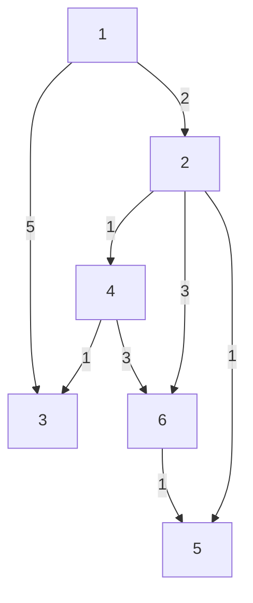
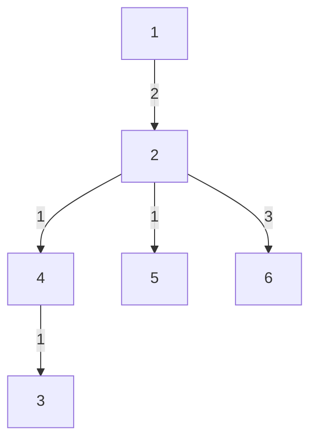

# Bellman-Ford Algorithm
## Algorithm Info
- History (in a line):- First proposed by Alfonso Shimbel (1955), but is instead named after Richard Bellman and Lester Ford Jr., who published it in 1958 and 1956, respectively
- Date implemented (by me):- 23 July 2023
- Type of problem it solves:- Finding Optimal(Min/Max) distance in a graph
- Alternatives:- [Dijstrka](https://github.com/DarkMenacer/Legacy/tree/main/Programming/Classic%20Algorithms/Dijstra/Dijstrka.md), [Floyd-Warshall](https://github.com/DarkMenacer/Legacy/tree/main/Programming/Classic%20Algorithms/Floyd%20Warshall/Floyd_Warshall.md)
- Complexity:- $O(|E|^2)$

---
## Explanation of algorithm

Bellman-Ford works on the principle that after $i$ iterations, shortest (or longest) distance to exactly $i$ vertices is known for sure.\
Therefore, if there are $n$ vertices, $n-1$  iterations are needed to find the shortest distance to all the vertices from the root vertex.

During each iteration, the algorithm goes through all the edges and tries to minimise their distance.
Initially distance of all vertices to the root vertex is set to be infinite and the distance of root vertex itself is set as 0.
The algorithm stops after $n-1$ iterations.

Bellman-Ford can also be used to check existence of a negatively weighted edge in the graph. If the distance between any 2 vertices further decreases after $n-1$ iterations,,
i.e. in the $n^{th}$ iteration, then the graph contains atleast one edge with negative edge.

[This](https://github.com/DarkMenacer/Legacy/tree/main/Programming/Classic%20Algorithms/Bellman%20Ford/Bellman_Ford.cpp) implementation is that to find the longest distance between any vertex and the root vertex (1 in this case).

## Sample to understand the solution

### I/O Format

#### Input
n m\
$a_1$ $b_1$ $c_1$\
...\
$a_m$ $b_m$ $c_m$

n = no. of vertices\
m = no. of edges\
all subsequent lines are the directed edges {a, b, c} where a is source, b is destination and c is the weight

#### Output
0 $d_2$ $d_3$ ...  $d_n$\
where $d_i$ represents the weighted distance between vertex $1$ and vertex $i$

### Sample Case

#### Input
6 8\
1 2 2\
1 3 5\
2 4 1\
2 6 3\
2 5 1\
4 3 1\
4 6 3\
6 5 1

#### Output
0 2 4 3 3 5

### Explanation

Initial graph

After shortest paths from vertex 1

---
